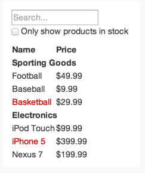
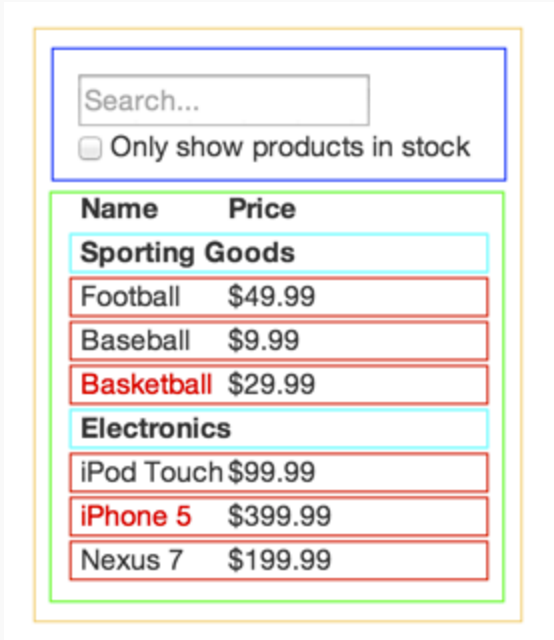

# Getting Started
## JSFiddle
開始學習 React 最簡單的方式就是使用以下 JSFiddle 的 Hello World 範例：

* [React JSFiddle](https://jsfiddle.net/reactjs/69z2wepo/)
* [React JSFiddle without JSX](https://jsfiddle.net/reactjs/5vjqabv3/)

## 從 npm 開始使用 React
我們建議配合類似 *browserify* 或 *webpack* 的CommonJS 模組系統使用 React。
使用`react`和`react-dom`的 npm 套件。

	// main.js
	var React = require('react');
	var ReactDOM = require('react-dom');
	
	ReactDOM.render(
	  <h1>Hello, world!</h1>,
	  document.getElementById('example')
	);

To install React DOM and build your bundle after installing browserify:
安裝 React DOM 和 安裝 browserify 後，建立你的包

	$ npm install --save react react-dom
	$ browserify -t babelify main.js -o bundle.js

## 不藉由 npm 快速開始
如果你還沒準備好使用 npm，你可以下載初学者教程包(Starter Kit)，包含了未預建置前的 React 和 React DOM 版本。

在 Starter Kit 的根目錄，建立一個包含以下內容的`helloworld.html`。

	<!DOCTYPE html>
	<html>
	  <head>
	    <meta charset="UTF-8" />
	    <title>Hello React!</title>
	    
	    
	    
	  </head>
	  <body>
	    

	    
	  </body>
	</html>

在 JavaScript 裡寫著 XML 格式的程式碼稱為 JSX，可以在 [JSX](https://facebook.github.io/react/docs/jsx-in-depth.html) 學到更多相關知識。為了把 JSX 轉成標準的 JavaScript，我們用``

>Note：某些瀏覽器（如，Chrome 瀏覽器）將無法載入該檔案，除非是套過 HTTP。

### 離線轉換
第一步，先透過 command-line 使用 [npm](https://www.npmjs.com/) 安裝 [Babel](http://babeljs.io/)  
`npm install --global babel`

然後將`src/helloworld.js`轉換成標準的 JavaScript
`babel src --watch --out-dir build`

每當你做任何修改後`build/helloworld.js`將會自動產生。可以閱讀 [Babel CLI document](http://babeljs.io/docs/usage/cli/) 瞭解更多使用方法。

	ReactDOM.render(
	  React.createElement('h1', null, 'Hello, world!'),
	  document.getElementById('example')
	);

更新 HTML 如下：

<!DOCTYPE html>
	<html>
	  <head>
	    <meta charset="UTF-8" />
	    <title>Hello React!</title>
	    
	    
	    <!-- No need for Babel! -->
	  </head>
	  <body>
	    

	    
	  </body>
	</html>

更多工具可以查看這邊
`https://github.com/facebook/react/wiki/Complementary-Tools`

---
# Tutorial
我們將建立一個簡單但是實用的評論框，可以將它放入你的部落格。一個類似於 Disqus, LiveFyre 或 Facebook 的即時評論的基本版本。
將會提供：

* 展示所有評論的介面
* 發佈評論的表單
* 後端 API 的串接位置，該串接需要自己實現

同時也包含一些簡潔的特性：

* **發布評論的體驗優化：**評論在儲存到服務器之前就會​​顯示在評論列表，因此感覺起來很快。
* **實時更新：**其他用戶的評論將會即時的顯示在評論框中。
* **Markdown格式：**用戶可以使用 Markdown 語法來編輯評論。

### 想要跳過後續所有的內容，只看原始碼？
[所有代碼都在GitHub。](https://github.com/reactjs/react-tutorial)

### 運行伺服器
為了開始本教程，將會需要一個在運作的伺服器。這將會是作為一個 API 接口，用於獲取和儲存資料。為了盡可能簡單，我們已經利用幾種腳本語言準備好了開發用的簡單伺服器。可以查看原始碼或者下載壓縮檔，裡面包含了所有開始學習教程所需的東西。

為了簡單起見，伺服器將會使用一個 JSON 文件作為資料庫。在生產環境中不會採用這種做法，但是這樣做確實簡化了模擬後端 API 的工作。一旦啟動了這個服務器，它就能提供我們需要的 API 接口，同時也能生成並發送我們需要的頁面。

### Getting started
本教程我們會盡可能的簡單。上述討論提及的頁面是一個 HTML 文件，它包含在伺服器的原始碼中，我們先看看這個文件。使用你最喜歡的編輯器打開`public/index.html`，它應該會看見這些內容（可能會有一些小的差異，後面我們會添加一個額外的`
	    
	    
	    
	  </head>
	  <body>
	    

	    
	    
	  </body>
	</html>

在本教程的剩下部分，我們會在這個 script 標籤中編寫我們的 JavaScript 程式碼。我們沒有任何高端的頁面自動重整工具，所以在更動程式碼之後，需要手動重整瀏覽器來查看變化。按照你的步驟，啟動伺服器後，可以在瀏覽器中輸入`http://localhost:3000`。在沒對原始碼進行修改的前提下，第一次打開這個 URL 會看到我們計劃建立的完成品。當你準備好開始往下學習後，只需要刪掉上述程式碼中的`
	  
	  
	  
	  
	</head>

接下來，將評論轉換成 Markdown，然後輸出：

	// tutorial6.js
	var Comment = React.createClass({
	  render: function() {
	    return (
	      

	        <h2 className="commentAuthor">
	          {this.props.author}
	        </h2>
	        {marked(this.props.children.toString())}
	      

	    );
	  }
	});

這裡我們唯一需要做的就是調用 marked library。我們需要把`this.props.children`從 React 的包裹文本轉換成 marked 能處理的原始字符串，所以我們明顯地調用了`toString()`。

但是這裡有一個問題！我們渲染的評論內容在瀏覽器裡面看起來像這樣：“ `
` This is `<em>` another `</em>` comment `
` ”。我們希望這些標籤能夠真正地渲染成 HTML。

那是 React 在保護你免受 XSS 攻擊。這裡有一種方法解決這個問題，但是框架會警告你別使用這種方法：

	// tutorial7.js
	var Comment = React.createClass({
	  rawMarkup: function() {
	    var rawMarkup = marked(this.props.children.toString(), {sanitize: true});
	    return { __html: rawMarkup };
	  },
	
	  render: function() {
	    return (
	      

	        <h2 className="commentAuthor">
	          {this.props.author}
	        </h2>
	        
	      

	    );
	  }
	});

這是一個特殊的API，故意讓插入原始的 HTML 變得困難，但是對於 marked ，我們將利用這個後門。

**記住：**使用這個功能，你的程式碼就要依賴於 marked 的安全性。在這情況中，我們傳入`sanitize: true`，告訴 marked 轉換掉評論文本中的 HTML 標籤而不是直接原封不動地返回這些標籤。

### 接入數據模型
到目前為止，已經在原始碼裡面直接插入了評論。讓我們將這些評論資料抽出來，放在一個 JSON 格式的變量中，然後將這個 JSON 資料渲染到評論列表。到最後，數據將會來自服務器，但是現在，直接寫在源代碼中：

	// tutorial8.js
	var data = [
	  {author: "Pete Hunt", text: "This is one comment"},
	  {author: "Jordan Walke", text: "This is *another* comment"}
	];

我們需要用一種模組化的方式將數據傳入到`CommentList`。修改`CommentBox`和`React.render()`方法，通過`props`傳遞數據到`CommentList`：

	// tutorial9.js
	var CommentBox = React.createClass({
	  render: function() {
	    return (
	      

	        <h1>Comments</h1>
	        <CommentList data={this.props.data} />
	        <CommentForm />
	      

	    );
	  }
	});
	
	ReactDOM.render(
	  <CommentBox data={data} />,
	  document.getElementById('content')
	);

現在資料已經可以在`CommentList`中使用了，讓我們動態地渲染評論：

	// tutorial10.js
	var CommentList = React.createClass({
	  render: function() {
	    var commentNodes = this.props.data.map(function (comment) {
	      return (
	        <Comment author={comment.author}>
	          {comment.text}
	        </Comment>
	      );
	    });
	    return (
	      

	        {commentNodes}
	      

	    );
	  }
	});

### 從伺服器獲取資料
當要從伺服器動態獲取的資料替換範例資料。可以刪掉 data 屬性，換上一個 URL 來獲取數據：

	// tutorial11.js
	ReactDOM.render(
	  <CommentBox url="/api/comments" />,
	  document.getElementById('content')
	);

這個元件和前面的元件是不一樣的，因為它必須重新渲染自己。在伺服器請求返回之前，該元件將不會有任何資料，等到請求返回之後，該元件可能會要渲染一些新的評論。

>**Note：**到此步驟，程式還沒辦法運作

### 響應狀態變化(Reactive state)
到目前為止，每一個元件都根據自己的`props`渲染了自己一次。`props`是不可變的：它們從父元件傳遞過來，“屬於”父元件。為了實現互動，我們給元件引入了可變的 **state**。`this.state`是元件私有的，可以通過調用`this.setState()`來改變它。當 state 更新之後，元件就會重新渲染自己。

`render()`方法依賴於`this.props`和`this.state`，框架會確保渲染出來的 UI 界面總是與輸入（`this.props`和`this.state`）保持一致。

當伺服器拿到評論資料的時候，將會改變我們有的評論資料。讓我們給`CommentBox`組件添加一個評論陣列作為它的`state`：

	// tutorial12.js
	var CommentBox = React.createClass({
	  getInitialState: function() {
	    return {data: []};
	  },
	  render: function() {
	    return (
	      

	        <h1>Comments</h1>
	        <CommentList data={this.state.data} />
	        <CommentForm />
	      

	    );
	  }
	});

`getInitialState()`在元件的生命週期中僅執行一次，用於設置元件的初始`state`。

#### 更新 state
在元件第一次創建的時候，我們想從伺服器得到（使用 GET 方法）一些 JSON 資料來更新狀態，以便顯示最新的資料。我們將會使用 jQuery 發送一個非同步請求到我們之前啟動好的伺服器，得到我們需要的資料。資料格式和相應代碼看起來會是這個樣子：

	[
	  {"author": "Pete Hunt", "text": "This is one comment"},
	  {"author": "Jordan Walke", "text": "This is *another* comment"}
	]

 

	// tutorial13.js
	var CommentBox = React.createClass({
	  getInitialState: function() {
	    return {data: []};
	  },
	  componentDidMount: function() {
	    $.ajax({
	      url: this.props.url,
	      dataType: 'json',
	      cache: false,
	      success: function(data) {
	        this.setState({data: data});
	      }.bind(this),
	      error: function(xhr, status, err) {
	        console.error(this.props.url, status, err.toString());
	      }.bind(this)
	    });
	  },
	  render: function() {
	    return (
	      

	        <h1>Comments</h1>
	        <CommentList data={this.state.data} />
	        <CommentForm />
	      

	    );
	  }
	});

這裡`componentDidMount`是一個元件渲染的時候會被 React 自動調用的方法。動態更新界面的關鍵點就是調用`this.setState()`。我們用從伺服器拿到的新資料來替換掉老的評論陣列，然後 UI 自動更新。有了這種反應機制，實現即時更新僅需要一小點改動。在這裡我們使用簡單的輪詢，但是你也可以很簡單地改為使用 WebSockets 或者其他技術。

	// tutorial14.js
	var CommentBox = React.createClass({
	  loadCommentsFromServer: function() {
	    $.ajax({
	      url: this.props.url,
	      dataType: 'json',
	      cache: false,
	      success: function(data) {
	        this.setState({data: data});
	      }.bind(this),
	      error: function(xhr, status, err) {
	        console.error(this.props.url, status, err.toString());
	      }.bind(this)
	    });
	  },
	  getInitialState: function() {
	    return {data: []};
	  },
	  componentDidMount: function() {
	    this.loadCommentsFromServer();
	    setInterval(this.loadCommentsFromServer, this.props.pollInterval);
	  },
	  render: function() {
	    return (
	      

	        <h1>Comments</h1>
	        <CommentList data={this.state.data} />
	        <CommentForm />
	      

	    );
	  }
	});
	
	ReactDOM.render(
	  <CommentBox url="/api/comments" pollInterval={2000} />,
	  document.getElementById('content')
	);

這裡，我們只需把 AJAX 移到另一個個別的方法中，在元件第一次載入的時候，以及之後每隔兩秒鐘都會呼叫這個方法。嘗試在你的瀏覽器中運行程式，然後改變`comments.json`文件(在server源碼文件夾中)；在兩秒鐘之內，改動將會顯示出來！

### 新增評論
現在可以開始構造表單了。我們的`CommentForm`元件應該詢問用戶的名字和評論內容，然後發送一個請求到服務器，保存這條評論。

	// tutorial15.js
	var CommentForm = React.createClass({
	  render: function() {
	    return (
	      <form className="commentForm">
	        <input type="text" placeholder="Your name" />
	        <input type="text" placeholder="Say something..." />
	        <input type="submit" value="Post" />
	      </form>
	    );
	  }
	});

讓我們使表單可互動。當用戶提交表單的時候，我們應該清空表單，發送一個請求到服務器，然後刷新評論列表。首先，讓我們監聽表單的提交事件，然後清空表單。

	// tutorial16.js
	var CommentForm = React.createClass({
	  handleSubmit: function(e) {
	    e.preventDefault();
	    var author = this.refs.author.value.trim();
	    var text = this.refs.text.value.trim();
	    if (!text || !author) {
	      return;
	    }
	    // TODO: send request to the server
	    this.refs.author.value = '';
	    this.refs.text.value = '';
	    return;
	  },
	  render: function() {
	    return (
	      <form className="commentForm" onSubmit={this.handleSubmit}>
	        <input type="text" placeholder="Your name" ref="author" />
	        <input type="text" placeholder="Say something..." ref="text" />
	        <input type="submit" value="Post" />
	      </form>
	    );
	  }
	});

##### 事件
React 使用駝峰式命名的方式給元件綁定事件處理器。我們給表單綁定一個`onSubmit`處理器，當表單提交了合法的輸入後，用於清空表單。

在事件中調用`preventDefault()`來避免提交表單後瀏覽器的默認操作。

##### Refs
我們利用`ref`屬性給子元件命名，通過`this.refs`引用 DOM 節點。

##### 用回呼函數作為屬性（props）
當使用者提交評論的時候，我們需要刷新評論列表來加進這條新評論。在`CommentBox`中完成所有邏輯是最合適的，因為`CommentBox`擁有代表評論列表的狀態（state）。

我們需要從子元件傳資料到它的父元件。我們在父元件的 render 方法中這樣做：傳遞一個新的回調函數（`handleCommentSubmit`）到子元件，綁定它到子元件的`onCommentSubmit`事件上。無論事件什麼時候觸發，回調函數都會被調用：

	// tutorial17.js
	var CommentBox = React.createClass({
	  loadCommentsFromServer: function() {
	    $.ajax({
	      url: this.props.url,
	      dataType: 'json',
	      cache: false,
	      success: function(data) {
	        this.setState({data: data});
	      }.bind(this),
	      error: function(xhr, status, err) {
	        console.error(this.props.url, status, err.toString());
	      }.bind(this)
	    });
	  },
	  handleCommentSubmit: function(comment) {
	    // TODO: submit to the server and refresh the list
	  },
	  getInitialState: function() {
	    return {data: []};
	  },
	  componentDidMount: function() {
	    this.loadCommentsFromServer();
	    setInterval(this.loadCommentsFromServer, this.props.pollInterval);
	  },
	  render: function() {
	    return (
	      

	        <h1>Comments</h1>
	        <CommentList data={this.state.data} />
	        <CommentForm onCommentSubmit={this.handleCommentSubmit} />
	      

	    );
	  }
	});

當用戶提交表單的時候，在`CommentForm`中調用這個回調函數：

	// tutorial18.js
	var CommentForm = React.createClass({
	  handleSubmit: function(e) {
	    e.preventDefault();
	    var author = this.refs.author.value.trim();
	    var text = this.refs.text.value.trim();
	    if (!text || !author) {
	      return;
	    }
	    this.props.onCommentSubmit({author: author, text: text});
	    this.refs.author.value = '';
	    this.refs.text.value = '';
	    return;
	  },
	  render: function() {
	    return (
	      <form className="commentForm" onSubmit={this.handleSubmit}>
	        <input type="text" placeholder="Your name" ref="author" />
	        <input type="text" placeholder="Say something..." ref="text" />
	        <input type="submit" value="Post" />
	      </form>
	    );
	  }
	});

現在回調函數已經就緒，我們唯一需要做的就是提交到伺服器，然後刷新評論列表：

	// tutorial19.js
	var CommentBox = React.createClass({
	  loadCommentsFromServer: function() {
	    $.ajax({
	      url: this.props.url,
	      dataType: 'json',
	      cache: false,
	      success: function(data) {
	        this.setState({data: data});
	      }.bind(this),
	      error: function(xhr, status, err) {
	        console.error(this.props.url, status, err.toString());
	      }.bind(this)
	    });
	  },
	  handleCommentSubmit: function(comment) {
	    $.ajax({
	      url: this.props.url,
	      dataType: 'json',
	      type: 'POST',
	      data: comment,
	      success: function(data) {
	        this.setState({data: data});
	      }.bind(this),
	      error: function(xhr, status, err) {
	        console.error(this.props.url, status, err.toString());
	      }.bind(this)
	    });
	  },
	  getInitialState: function() {
	    return {data: []};
	  },
	  componentDidMount: function() {
	    this.loadCommentsFromServer();
	    setInterval(this.loadCommentsFromServer, this.props.pollInterval);
	  },
	  render: function() {
	    return (
	      

	        <h1>Comments</h1>
	        <CommentList data={this.state.data} />
	        <CommentForm onCommentSubmit={this.handleCommentSubmit} />
	      

	    );
	  }
	});

### 優化：提前更新
我們的應用程式現在已經完成了所有功能，但是在新的評論出現在列表之前，必須等待請求完成，感覺很慢。我們可以提前添加這條評論到列表中，從而使之感覺更快。

	// tutorial20.js
	var CommentBox = React.createClass({
	  loadCommentsFromServer: function() {
	    $.ajax({
	      url: this.props.url,
	      dataType: 'json',
	      cache: false,
	      success: function(data) {
	        this.setState({data: data});
	      }.bind(this),
	      error: function(xhr, status, err) {
	        console.error(this.props.url, status, err.toString());
	      }.bind(this)
	    });
	  },
	  handleCommentSubmit: function(comment) {
	    var comments = this.state.data;
	    var newComments = comments.concat([comment]);
	    this.setState({data: newComments});
	    $.ajax({
	      url: this.props.url,
	      dataType: 'json',
	      type: 'POST',
	      data: comment,
	      success: function(data) {
	        this.setState({data: data});
	      }.bind(this),
	      error: function(xhr, status, err) {
	        console.error(this.props.url, status, err.toString());
	      }.bind(this)
	    });
	  },
	  getInitialState: function() {
	    return {data: []};
	  },
	  componentDidMount: function() {
	    this.loadCommentsFromServer();
	    setInterval(this.loadCommentsFromServer, this.props.pollInterval);
	  },
	  render: function() {
	    return (
	      

	        <h1>Comments</h1>
	        <CommentList data={this.state.data} />
	        <CommentForm onCommentSubmit={this.handleCommentSubmit} />
	      

	    );
	  }
	});

剛剛通過一些簡單步驟構造了一個評論框。了解更多關於[為什麼使用 React](https://facebook.github.io/react/docs/why-react.html) 的內容，或者深入學習 [API 文件](https://facebook.github.io/react/docs/top-level-api.html)。

---
# Thinking in React
by Pete Hunt

React is, in my opinion, the premier way to build big, fast Web apps with JavaScript. It has scaled very well for us at Facebook and Instagram.

One of the many great parts of React is how it makes you think about apps as you build them. In this post, I'll walk you through the thought process of building a searchable product data table using React.

## 從原型(mock)開始
假設我們已經擁有了一個 JSON API 和設計師設計的原型。原型看起來如下：

JSON API 返回資料如下：

	[
	  {category: "Sporting Goods", price: "$49.99", stocked: true, name: "Football"},
	  {category: "Sporting Goods", price: "$9.99", stocked: true, name: "Baseball"},
	  {category: "Sporting Goods", price: "$29.99", stocked: false, name: "Basketball"},
	  {category: "Electronics", price: "$99.99", stocked: true, name: "iPod Touch"},
	  {category: "Electronics", price: "$399.99", stocked: false, name: "iPhone 5"},
	  {category: "Electronics", price: "$199.99", stocked: true, name: "Nexus 7"}
	];

## 第一步：拆分 UI 到元件階層
要做的第一件事是，為所有元件（及子元件）命名並畫上線框圖。假如你和設計師一起工作，也許他們已經完成了這項工作，所以趕緊去跟他們討論！他們的 Photoshop 圖層名也許最終可以直接用於你的 React 元件命名。

然而你如何知道哪些才能成為元件？當你創建一些函數或對象時，用到一些類似的技術。其中一項技術就是單一功能原則，指的是，理想狀態下一個元件應該只做一件事，假如它功能逐漸變大就需要被拆分成更小的子元件。

由於你經常需要將一個 JSON 資料模型展示給用戶，你將會發現一旦模型結構正確建立，你的
 UI (和你的元件結構)也會正確的映射。這是因為 UI 和資料模型往往跟信息構造一致，這意味著將你可以省下很多將UI分割成組件的麻煩事。你需要做的僅僅只是將數據模型分隔成一小塊一小塊的組件，以便它們都能夠表示成元件。

由此可見，我們的app 中包含五個組件。下面我已經用斜體標示出每個組件對應的數據。

1. `FilterableProductTable`**（橘色）**：包含整個例子的容器  
2. `SearchBar`**（藍色）**：接受所有用戶輸入*（user input）*
3. `ProductTable`**（綠色）**：根據用戶輸入*（user input）*過濾和顯示資料集合*（data collection）*
6. `ProductCategoryRow`**（青色）**：為每個分類*（category）*展示一列表頭
5. `ProductRow`**（紅色）**：為每個產品*（product）*展示一列

如果你仔細觀察`ProductTable`，你會發現表頭（包含 “Name” 和 “Price” 標籤）並不是單獨的元件。這只是一種個人偏好，也有一定的爭論。在這個例子當中，我把表頭當做`ProductTable`的一部分，因為它是渲染*數據集合(data collection)*的一份子，這也是`ProductTable`的職責。但是，當這個表頭變得複雜起來的時候（例如，添加排序功能），就應該單獨地寫一個`ProductTableHeader`元件。

既然我們在原型當中定義了這個元件，讓我們把這些元素組成一棵樹形結構。這很簡單。被包含在其它組件中的組件在屬性機構中應該是子級：

* `FilterableProductTable`
	* `SearchBar`
	* `ProductTable`
		* `ProductCategoryRow`
		* `ProductRow`

## 第二步：利用 React，創建應用的一個靜態版本
[JSFiddle 範例](https://jsfiddle.net/reactjs/yun1vgqb/light/)

既然現在已經有了你的元件階層圖，就可以開始實作 app 了。最簡單的方式就是建立一版雖然有你的資料模型和渲染到 UI，但是沒有互動功能。拆分這兩個過程是最好的方式，因為構建一個靜態的版本僅需要大量的編寫，但不需要思考；但是添加互動功能卻需要大量的思考和少量的編寫。我們將會知道這是為什麼。

為了創建一個渲染資料模型的應用的靜態版本，你會想要建立一些可重複使用在其它元件，並且透過`props`傳遞資料。`props`是一種從父級向子級傳遞資料的方式。如果你對`state`概念熟悉，那麼**不要使用`state`**來建造這個靜態版本。`State`僅用於實現互動功能，也就是說，資料會隨著時間變化。因為這是一個靜態的應用版本，所以你並不需要`state`。

你可以從上至下或者從下至上來建立。也就是說，你可以從元件階層的頂部開始建立這些元件（例如，從`FilterableProductTable`開始），或者從底部開始（`ProductRow`）。在簡單的應用中，通常情況下從上至下的方式更加簡單；在大型的專案中，從下至上的方式更加簡單，這樣也可以在構建的同時寫測試代碼。

在這步驟結束的時候，將會有一個可重複使用的元件 library 來渲染資料模型。這些元件將會只有`render()`方法，因為這是應用程式的一個靜態版本。位於階層頂部的元件（`FilterableProductTable`）將會使用資料模型作為`prop`。如果你改變底層資料模型，然後再次調用`React.render()`，UI 將會更新。查看 UI 如何被更新和什麼地方改變都是很容易的，因為 React 的**單向資料流**（也被稱作“單向綁定”）使得一切模組化，很容易查錯，並且速度很快。

如果你在此步驟中需要幫助，請查看 [React 文件](https://facebook.github.io/react/docs/getting-started.html)。

### 穿插一小段內容： props 與state 比較
在 React 中有兩種類型的資料“模型”：`props`和`state`。理解兩者的區別是很重要的；如果你不太確定兩者有什麼區別，請大致瀏覽一下[官方的 React 文件](https://facebook.github.io/react/docs/interactivity-and-dynamic-uis.html)。

## 第三步：找出最小（但是完整的）代表的 UI state
為了使 UI 可以互動，需要能夠觸發底層資料模型的變化。React 通過**state**使這變得簡單。

為了正確打造應用程式，首先需要考慮應用程式所需要的最小可變 state 集合。此處關鍵點在於 DRY：Don't Repeat Yourself。找出滿足應用程式所需要的絕對最小代表 state 是有必要的，並且計算出其它強烈需要的東西。例如，如果建造一個 TODO 列表，僅保存一個 TODO 列表項目的陣列，而不需要保存另外一個儲存陣列長度的 state 變數。當想要渲染 TODO 列表項目總數的時候，簡單地取出TODO列表項目陣列的長度就可以了。

思考範例中的所有資料片段，有：

* 最初的 products 列表
* 使用者可以輸入的搜索表單
* 複選框的值
* 過濾後的 products 列表

讓我們分析每一項目，找出哪一個是 state。簡單地對每一項目提出三個問題：

1. 是否是從父級通過`props`傳入的？如果是，可能不是 state 。
2. 是否會隨著時間改變？如果不是，可能不是 state 。
3. 能根據元件中其它 state 或者 props 計算出來嗎？如果是，就不是state 。

初始的 products 列表通過 props 傳入，所以不是 state。搜索表單和復選框看起來像是state，因為它們隨著時間改變，也不能根據其它數據計算出來。最後，過濾的 products 列表不是 state，因為可以通過搜索表單和復選框的值從初始的 products 列表計算出來。

所以最終，state 是：

* 使用者可以輸入的搜索表單
* 複選框的值

## 第四步：找出 state 的生命週期
[JSFiddle 範例](https://jsfiddle.net/reactjs/zafjbw1e/light/)

OK，現在我們找出了應用程式的 state 的最小集合。接下來，需要找出哪個元件會改變或者說擁有這個 state。

記住：React 中資料是沿著元件階層從上到下單向資料流動的。可能不會立刻明白哪個元件應該擁有哪些 state。**這對新手來說通常是最難理解和最具挑戰的**，因此跟隨以下步驟來弄清楚這點：

對於應用程式中的每一個 state：

* 找出每一個基於那個 state 渲染界面的元件。
* 找出共同的祖先元件（在元件階層中，某個單一元件高於所的元件之上需要這個 state）。
* 若不是共同的祖先元件，就是另外一個在元件階層中位於更高層級的元件應該擁有這個state。
* 如果找不出擁有這個 state 的合適元件，創建一個新的元件來維護這個 state，然後添加到元件階層中，層級位於所有共同擁有者元件的上面。

讓我們在應用程式中應用這個策略：

* `ProductTable`需要基於 state 過濾產品列表，`SearchBar`需要顯示搜索表單和復選框狀態。
* 共同祖先元件是`FilterableProductTable`。
* 理論上，過濾表單和復選框值位於`FilterableProductTable`中是合適的。

我們決定了 state 位於`FilterableProductTable`之中。首先，給`FilterableProductTable`添加`getInitialState()`方法，並返回`{filterText: '', inStockOnly: false}`來反映應用程式的初始 state。然後傳遞`filterText`和`inStockOnly`給`ProductTable`和`SearchBar`作為 prop 。最後，使用這些 props 來過濾`ProductTable`中的行，設置在`SearchBar`中表單欄位的值。

你可以開始觀察應用程式將會如何運行：設置`filterText`為`"ball"`，然後刷新應用。將會看到表格被正確更新了。

## 第五步：添加反向數據流
[JSFiddle 範例](https://jsfiddle.net/reactjs/n47gckhr/light/)

到目前為止，已經建立了基於 props 和 state 沿著階層圖從上至下單向數據流動正確渲染的應用程式。現在，是時候支援另外一種資料流動方式了：元件階層圖中層級很深的表單元件需要更新`FilterableProductTable`中的 state。

React 讓這種資料流動非常明確，從而很容易理解應用程式是如何工作的，但是相對於傳統的雙向綁定，確實需要輸入更多的東西。React 提供了一個叫做`ReactLink`的插件來使其和雙向綁定一樣方便，但是考慮到這篇文章的目的，我們將會盡量把所有東西都直截了當。

如果你嘗試在當前版本的範例中輸入或者點擊復選框，將會發現 React 會忽略你的輸入。這是有意的，因為已經設置了`input`的`value`屬性，使其總是與從`FilterableProductTable`傳遞過來的`state`一致。

讓我們思考下我們希望發生什麼。我們想確保無論使用者何時改變了表單，都要更新 state 來反映使用者的輸入。由於元件只能更新自己的 state，`FilterableProductTable`將會傳遞一個回調函數給`SearchBar`，此函數將會在 state 應該被改變的時候觸發。我們可以使用 input 的`onChange`事件來監聽用戶輸入，從而確定何時觸發回調函數。`FilterableProductTable`傳遞的回調函數將會調用`setState()`，然後應用程式將會被更新。

雖然這聽起來有很多內容，但是實際上僅僅需要幾行代碼。並且關於數據在應用中如何流動真的非常清晰明確。

